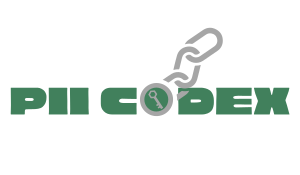

<p align="center">

</p>
<hr/>

# PII Codex - PII Detection, Categorization, and Severity Assessment
[](https://www.python.org/)

[](https://GitHub.com/EdyVision/pii-codex/graphs/commit-activity)
[](https://opensource.org/licenses/BSD-3-Clause)
[](https://firstdonoharm.dev)
[](https://www.python.org/downloads/release/python-390/)

The PII Codex project was built as a core part of an ongoing research effort in Personal Identifiable Information (PII) detection and risk assessment. There was a need to not only detect PII in unstructured text, but also identify its severity, associated categorizations in cybersecurity research and policy documentation, and provide a way for others in similar research efforts to reproduce or extend the research. PII Codex is a combination of systematic research, conceptual frameworks, third-party open source software, and cloud service provider integrations. The categorizations are directly influenced by the research of Milne et al. (2016) while the ranking is a result of category severities on the scale provided by Schwartz and Solove (2012) from Non-Identifiable, Semi-Identifiable, and Identifiable.

The output of the primary PII Codex analysis and adapter functions are AnalysisResult or AnalysisResultSet objects that will provide a listing of detections, severities, mean risk scores for each string processed, and summary statistics on the analysis made. The final outputs do not contain the original texts but instead will provide where to find the detections should the end-user care for this information in their analysis.

<hr/>

## Importing
The repository releases are hosted on PyPi.

Using pip:

```bash
pip3 install -i pii-codex
```

Using Poetry:

```bash
poetry add pii-codex
```

If you are in need of the integrated Microsoft Presidio Analyzer, you'll also need to install the `en_core_web_lg` and the PII-Codex extras:

```bash
poetry install pii-codex --extras="detections"
python3 -m spacy download en_core_web_lg
```

## Usage

### Sample Input / Output
The built-in analyzer uses Microsoft Presidio. Feed in a collection of strings with analyze_collection() or just a single string with analyze_item(). Those analyzing a collection of strings will also be provided with statistics calculated on the risk scores for detected items.
```python
from pii_codex.services.analysis_service import PIIAnalysisService
PIIAnalysisService().analyze_collection(
    texts=["your collection of strings"],
    language_code="en",
    collection_name="Data Set Label", # Optional Labeling
    collection_type="SAMPLE" # Defaults to POPULATION, used stats calculations
)
```

Sample output (results object converted to `dict` from notebook):
```
{
    "collection_name": "PII Collection 1",
    "collection_type": "POPULATION",
    "analyses": [
        {
            "analysis": [
                {
                    "pii_type_detected": "PERSON",
                    "risk_level": 3,
                    "risk_level_definition": "Identifiable",
                    "cluster_membership_type": "Financial Information",
                    "hipaa_category": "Protected Health Information",
                    "dhs_category": "Linkable",
                    "nist_category": "Directly PII",
                    "entity_type": "PERSON",
                    "score": 0.85,
                    "start": 21,
                    "end": 24,
                }
            ],
            "index": 0,
            "risk_score_mean": 3,
        },
        ...
    ],
    "detection_count": 5,
    "risk_scores": [3, 2.6666666666666665, 1, 2, 1],
    "risk_score_mean": 1.9333333333333333,
    "risk_score_mode": 1,
    "risk_score_median": 2,
    "risk_score_standard_deviation": 0.8273115763993905,
    "risk_score_variance": 0.6844444444444444,
    "detected_pii_types": [
        "LOCATION",
        "EMAIL_ADDRESS",
        "URL",
        "PHONE_NUMBER",
        "PERSON",
    ],
    "detected_pii_type_frequencies": {
        "PERSON": 1,
        "EMAIL_ADDRESS": 1,
        "PHONE_NUMBER": 1,
        "URL": 1,
        "LOCATION": 1,
    },
}
```

### Docs
For more information on usage, check out the respective documentation for guidance on using PII-Codex.

| Topic                       | Document                                                     | Description                                                                              |
|-----------------------------|--------------------------------------------------------------|------------------------------------------------------------------------------------------|
| PII Type Mappings           | [PII Mappings](docs/MAPPING.md)                              | Overview of how to perform mappings between PII types and how to review store PII types. |
| PII Detections and Analysis | [PII Detection and Analysis](docs/DETECTION_AND_ANALYSIS.md) | Overview of how to detect and analyze strings                                            |
| Local Repo Setup            | [Local Repo Setup](docs/LOCAL_SETUP.md)                      | Instructions for local repository setup                                                  |
| Example Analysis            | [Example Analysis Notebook](notebooks/pii-analysis-ms-presidio.ipynb)  | Notebook with example analysis using MSFT Presidio                             |

<hr/>

## Community Guidelines
### Contributions
In general, you can contribute to this project by creating issues. You are also welcome to contribute to the source code directly by forking the project, modifying the code, and creating pull requests. Please use clear and organized descriptions when creating issues and pull requests and leverage the templates when possible.

### Bug Report and Support Requests
You can use issues to report bugs and seek support. Before creating any new issues, please check for similar ones in the issue list first.

## Attributions
This project benefited greatly from a number of PII research works like that from Milne et al (2016), Schwartz and Solove (2012), and the documentation by NIST, DHS, and HIPAA. A special thanks to all the open source projects, and frameworks that made the setup and structuring of this project much easier like Poetry, Microsoft Presidio, spaCy, Jupyter, and several others.
