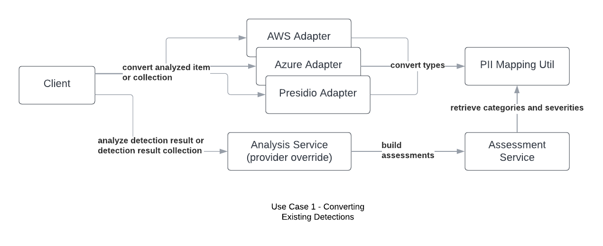
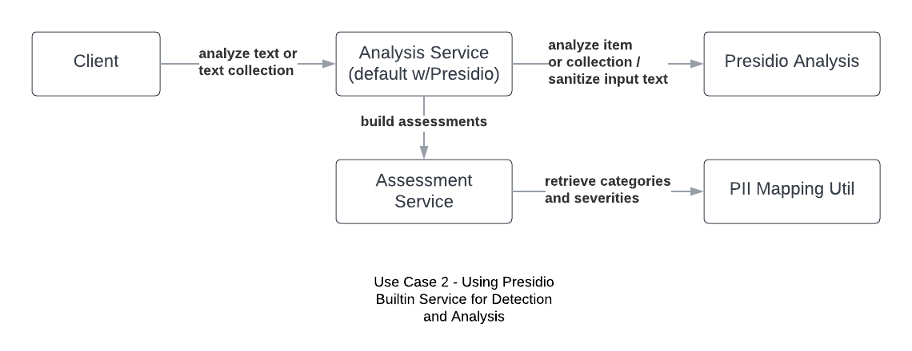

# Detection and Analysis with PII-Codex
In the case that you are not bringing your own detection service, Microsoft Presidio is integrated into PII Codex that provides flexibility in analyzer type. At the time of this repo's creation, only a select number of evaluators exist. You may create your own evaluators and swap out the version of presidio that pii-codex uses. Note that with this change, you will also need to update the mappings where applicable.

The following are not integrated into the service, but have PII type mapping and detection object conversion support:

<ol>
    <li>AWS Comprehend (Requires AWS Account) [<a href="https://docs.aws.amazon.com/comprehend/latest/dg/how-pii.html">docs</a>]</li>
    <li>Azure PII Detection Cognitive Skill (Requires Azure Account) [<a href="https://learn.microsoft.com/en-us/azure/search/cognitive-search-skill-pii-detection">docs</a>]</li>
</ol>

For those using pre-detected results, adapters are provided to convert types and results to the expected DetectionResult/DetectionResultItem format (see diagram below):



To supply the analyzer module with a collection of pre-detected results from your own Microsoft Presidio, Azure, or AWS Comprehend analysis process, you will need to first convert the detection to a set of DetectionResult objects to feed into the analyzer as follows:

```python
from typing import List
from pii_codex.models.common import (
    AnalysisProviderType,
)
from presidio_analyzer import RecognizerResult
from pii_codex.services.analysis_service import PIIAnalysisService
from pii_codex.services.adapters.detection_adapters.presidio_detection_adapter import PresidioPIIDetectionAdapter
from pii_codex.models.analysis import DetectionResult

presidio_detection_service = PresidioPIIDetectionAdapter()

list_of_detections: List[RecognizerResult] = [] # your list of detections 
converted_detections: List[DetectionResult] = presidio_detection_service.convert_analyzed_collection(
                                                    pii_detections=list_of_detections
                                              )
pii_analysis_service = PIIAnalysisService(
    analysis_provider=AnalysisProviderType.PRESIDIO.name
)  # If you don't intend to use presidio, override the analysis_provider value

results = pii_analysis_service.analyze_detection_collection(
    detection_collection=converted_detections,
    collection_name="Data Set Label",  # this is more for those that intend to find a way to label collections
    collection_type="SAMPLE"  # defaults to POPULATION, input used for standard deviation and variance calculations
)
```

The other two detection adapters available are AWSComprehendPIIDetectionAdapter and AzurePIIDetectionAdapter. 

<hr>

In the case you require the built-in Presidio functionality, you can call the analysis service as follows:

```python
from pii_codex.services.analysis_service import PIIAnalysisService

pii_analysis_service = PIIAnalysisService()

strings_to_analyze = ["string to analyze", "string to analyze"] # strings to analyze
results = pii_analysis_service.analyze_collection(
    texts=strings_to_analyze,
    language_code="en",
    collection_name="Data Set Label", # this is optional, geared for those that require labeling of collections
    collection_type="SAMPLE" # defaults to POPULATION, input used for standard deviation and variance calculations
)
```

This functionality can easily take a singular text item or a collection of them and runs through the presidio analysis and assessment service files as presented in the diagram below.




For those analyzing social media posts, you can also supply metadata per text sample to be analyzed in a dataframe.

```python
import pandas as pd
from pii_codex.services.analysis_service import PIIAnalysisService

pii_analysis_service = PIIAnalysisService()

results = pii_analysis_service.analyze_collection(
    data=pd.DataFrame({
        "text": [
            "I attend the University of Central Florida, how about you?",
            "If anyone needs trig help, my phone number 555-555-5555 and my email is example123@email.com",
            "Oh I do! My number is 777-777-7777. Where is the residence hall?",
            "The dorm is over at 123 Dark Data Lane, OH, 11111",
            "Cool, I'll be there!"
        ],
        "metadata": [
            {"location": True, "url": False, "screen_name": True},
            {"location": True, "url": False, "screen_name": True},
            {"location": False, "url": False, "screen_name": True}, # Not all social media posts will have location metadata
            {"location": False, "url": False, "screen_name": True},
            {"location": True, "url": False, "screen_name": True},
        ]
    }),
    language_code="en",
    collection_name="Data Set Label", # this is optional, geared for those that require labeling of collections
    collection_type="SAMPLE" # defaults to POPULATION, input used for standard deviation and variance calculations
)
```

Sample output:

```
{
    "collection_name": "PII Collection 1",
    "collection_type": "POPULATION",
    "analyses": [
        {
            "analysis": [
                {
                    "pii_type_detected": "PERSON",
                    "risk_level": 3,
                    "risk_level_definition": "Identifiable",
                    "cluster_membership_type": "Financial Information",
                    "hipaa_category": "Protected Health Information",
                    "dhs_category": "Linkable",
                    "nist_category": "Directly PII",
                    "entity_type": "PERSON",
                    "score": 0.85,
                    "start": 21,
                    "end": 24,
                }
            ],
            "index": 0,
            "risk_score_mean": 3,
            "sanitized_text": "Hi! My name is <REDACTED>",
        },
        {
            "analysis": [
                {
                    "pii_type_detected": "EMAIL_ADDRESS",
                    "risk_level": 3,
                    "risk_level_definition": "Identifiable",
                    "cluster_membership_type": "Personal Preferences",
                    "hipaa_category": "Protected Health Information",
                    "dhs_category": "Stand Alone PII",
                    "nist_category": "Directly PII",
                    "entity_type": "EMAIL_ADDRESS",
                    "score": 1.0,
                    "start": 74,
                    "end": 94,
                },
                {
                    "pii_type_detected": "PHONE_NUMBER",
                    "risk_level": 3,
                    "risk_level_definition": "Identifiable",
                    "cluster_membership_type": "Contact Information",
                    "hipaa_category": "Protected Health Information",
                    "dhs_category": "Stand Alone PII",
                    "nist_category": "Directly PII",
                    "entity_type": "PHONE_NUMBER",
                    "score": 0.75,
                    "start": 45,
                    "end": 57,
                },
                {
                    "pii_type_detected": "URL",
                    "risk_level": 2,
                    "risk_level_definition": "Semi-Identifiable",
                    "cluster_membership_type": "Community Interaction",
                    "hipaa_category": "Not Protected Health Information",
                    "dhs_category": "Linkable",
                    "nist_category": "Linkable",
                    "entity_type": "URL",
                    "score": 0.5,
                    "start": 85,
                    "end": 94,
                },
            ],
            "index": 1,
            "risk_score_mean": 2.6666666666666665,
            "sanitized_text": "Hi! My phone number is <REDACTED>. You can also reach me by email at <REDACTED>",
        },
        {
            "analysis": [
                {
                    "pii_type_detected": None,
                    "risk_level": 1,
                    "risk_level_definition": "Non-Identifiable",
                    "cluster_membership_type": None,
                    "hipaa_category": None,
                    "dhs_category": None,
                    "nist_category": None,
                }
            ],
            "index": 2,
            "risk_score_mean": 1,
            "sanitized_text": "Hi! What is the title of this book?",
        },
        {
            "analysis": [
                {
                    "pii_type_detected": "LOCATION",
                    "risk_level": 2,
                    "risk_level_definition": "Semi-Identifiable",
                    "cluster_membership_type": "Secure Identifiers",
                    "hipaa_category": "Protected Health Information",
                    "dhs_category": "Not Mentioned",
                    "nist_category": "Linkable",
                    "entity_type": "LOCATION",
                    "score": 0.85,
                    "start": 42,
                    "end": 44,
                }
            ],
            "index": 3,
            "risk_score_mean": 2,
            "sanitized_text": "<REDACTED>",
        },
        {
            "analysis": [
                {
                    "pii_type_detected": None,
                    "risk_level": 1,
                    "risk_level_definition": "Non-Identifiable",
                    "cluster_membership_type": None,
                    "hipaa_category": None,
                    "dhs_category": None,
                    "nist_category": None,
                }
            ],
            "index": 4,
            "risk_score_mean": 1,
            "sanitized_text": "Hi! I have a cat too.",
        },
    ],
    "detection_count": 5,
    "risk_scores": [3, 2.6666666666666665, 1, 2, 1],
    "risk_score_mean": 1.9333333333333333,
    "risk_score_mode": 1,
    "risk_score_median": 2,
    "risk_score_standard_deviation": 0.8273115763993905,
    "risk_score_variance": 0.6844444444444444,
    "detected_pii_types": {
        "LOCATION",
        "EMAIL_ADDRESS",
        "URL",
        "PHONE_NUMBER",
        "PERSON",
    },
    "detected_pii_type_frequencies": {
        "PERSON": 1,
        "EMAIL_ADDRESS": 1,
        "PHONE_NUMBER": 1,
        "URL": 1,
        "LOCATION": 1,
    },
}

```

Check out full analysis example in the notebook: notebooks/pii-analysis-ms-presidio.