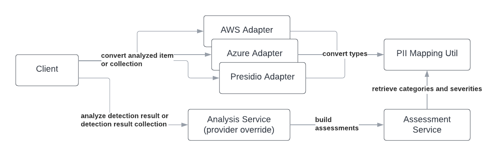

# Summary
There have been a number of advancements in the detection of personal identifiable information (PII) and scrubbing libraries to aid developers and researchers in their detection and anonymization efforts. With the recent shift in data handling procedures and global policy implementations regarding identifying information, it is becoming more important for data consumers to be aware of what data needs to be scrubbed, why it's being scrubbed, and to have the means to perform said scrubbing. 

PII-Codex is a collection of extended theoretical, conceptual, and policy works in PII categorization and severity assessment [@schwartz_solove_2011; @milne_pettinico_hajjat_markos_2016], and the integration thereof with PII detection software and API client adapters. It allows researchers to analyze a body of text or a collection thereof and determine whether the PII detected within these texts, if any, are considered identifiable. Furthermore, it allows end-users to determine the severity and associated categorizations of detected PII tokens.

# Challenges

While a number of open-source PII detection libraries have been created and PII detection APIs are provided by cloud service providers [@azure_detection_cognitive_skill; @aws_comprehend], the detection results are often provided with the type of PII detected, an index reference of where the detection is within the text, and a confidence score associated with the detection. Those receiving these results aren’t provided with a means of understanding why the text token is classified as PII, what framework, policy, or convention labels it as such, and just how severe its exposure is.

# Statement of Need

The general knowledge base of identifiable data, the usage restrictions of this data, and the associated policies surrounding it have shifted drastically over the years. Between the mid-1990s and 2000s, or the dotcom bubble, the industry saw a rise in data capitalism by way of making information freely accessible, fostering a way to make the web personal, and finally, placing value on data and the potential it had to impact consumerism [@West_2017]. Alongside the rise in data capitalism came early data policy initiatives. In 1995, the EU Data Protection Directive was created to establish some minimum data privacy and security standards [@GDPR_eu_2022] and the US Health Insurance Portability and Accountability Act (HIPAA) was enacted in 1996 with the final regulation being published in 2000 [@OCR_2022] to help battle healthcare fraud and to provide regulations governing the privacy and security of an individual's patient details. Both of these policies have evolved over the years to include protected entities and have paved the way to the policies and protective technologies the world sees today aimed at protecting PII.

The tech industry specifically has had to adjust to these policy changes regarding the tracking of individuals, the usage of data from online profiles and platforms, and the right to be forgotten entirely from a service or platform [@gdpr_erasure_right]. While the shift has provided data protections around the globe, the majority of technology users continue to have little to no control over their personal information with third-party data consumers [@tene_polonetsky_2012; @trepte2020]. From an individual researcher's perspective, understanding if identifiable data types exist in a data set can prevent accidental sharing of such data by allowing its detection in the first place and, in the case of this software package, permit for the results to be publishable by sanitizing the text tokens and provide transparency on the reasons why the token was considered to be PII. From a platform user's perspective, detecting PII ahead of publication and understanding why it is considered PII can prevent an accidental disclosure that can later be used by adversaries. This need is what drives the development of PII-Codex.

# The PII-Codex Package

PII-Codex is a Python package built to combine the Information Sensitivity Typology works of Milne et al. [@milne_pettinico_hajjat_markos_2016], categorizations and guidelines from the National Institute of Standards and Technology (NIST) [@mccallister_grance_scarfone_2010], Department of Homeland Security (DHS) [@dhs_2012], and the Health Insurance Portability and Accountability Act (HIPAA) [@hipaa]. It combines these categories to rate the detection on a scale of 1 to 3, labeling it as <em>Non-Identifiable</em>, <em>Semi-Identifiable</em>, or <em>Identifiable</em> as presented by the risk continuum by Schwartz and Solove [@schwartz_solove_2011].  The package provides a subset of Milne et al.'s Information Sensitivity Typology as some technologies group entries into a singular category or the detection of the entry may not yet be available.

Built into the package is an analyzer service that leverages Microsoft’s Presidio library for PII detection and anonymization [@microsoft_presidio] as well as the option to use the built-in detection adapters for Microsoft Presidio, Azure Detection Cognitive Skill [@azure_detection_cognitive_skill], and AWS Comprehend [@aws_comprehend] for pre-existing detections. The output of the adapters and the analysis service are analysis objects with a listing of detections, detection frequencies, severities, mean risk scores for each string processed, and summary statistics on the analysis made. 

The final outputs do not contain the original texts but provide the sanitized or anonymized texts and where to find the detections, should the end-user require this information. In providing this capability, one can prevent the accidental dissemination of private information in downstream research efforts, an issue commonly discussed in cybersecurity research [@belanger_crossler_2011; @moura_serrão_2019; @beigi_liu_2020].

## Design

PII-Codex is broken down into a series of services, utilities, and adapters. For a majority of cases, end-users may already have used Microsoft Presidio, Azure, AWS Comprehend or some other solution to detect PII in text. To account for these cases, adapters were provided to convert the varying detection results into a common form, <em>DetectionResultItem</em> and <em>DetectionResult</em> objects, which are later used by the Analysis Service and Assessment Service. This usage flow is presented in Figure 1.



As shown in Figure 2, for end-users that still require detections to be carried out, Microsoft Presidio was integrated as the primary analysis provider within the Analysis Service.


The Analysis and Assessment services expose functions for those defining their own detectors and enable the conversion to a common detection type so that the full Analysis Result set can be built.

## Example Usage

The collection analysis permits a list of strings under 
<em>texts</em> parameter or a DataFrame with a text column under the <em>data</em> parameter. The collection will be analyzed and a summary provided in an AnalysisResultSet object. The AnalysisResultSet object will show individual detections and their risk assessments which includes risk score assessment and associated PII categories. Each analysis is provided with the sanitized input text when using the default analysis service. Unless supplied with another replacement token, the sanitized input text will contain <em><REDACTED></em> in place of detected PII tokens:

```
Hi! My phone number is <REDACTED>."
```

Email detections, for example, are presented as <em>Identifiable</em>, which automatically places it at a risk level of <em>3</em>, the highest a token is assigned. Something like a URL is considered <em>Semi-Identifiable</em> and therefore is assigned a risk level of <em>2</em>. Other texts will fall under <em>Non-Identifiable</em> and will be assigned a risk level of <em>1</em>.

Using the `texts` parameter:

```python
from pii_codex.services.analysis_service import PIIAnalysisService

results = PIIAnalysisService().analyze_collection(
    texts=[
        "email@example.com is the email I can be reached at.", 
        "Their number is 555-555-5555"
    ]
)
```

Using the `data` parameter with metadata support for social media analysis:

```python
import pandas as pd
from pii_codex.services.analysis_service import PIIAnalysisService

results = PIIAnalysisService().analyze_collection(
    data=pd.DataFrame.from_dict({
        "text": [
            "email@example.com is the email I can be reached at.", 
            "Their number is 555-555-5555"
        ],
        "metadata": [
            {"location": True, "url": False, "screen_name": True},
            {"location": False, "url": False, "screen_name": True}
        ]
    }),
    collection_name="Social Media Example",
    collection_type="SAMPLE"
)
```

The AnalysisResultSet object will show individual detections and their risk assessments. Email detections, for example, are presented as identifiable and direct PII which automatically place it at a risk level of 3, the highest a token is assigned.


```json
{
    "pii_type_detected": "EMAIL_ADDRESS",
    "risk_level": 3,
    "risk_level_definition": "Identifiable",
    "cluster_membership_type": "Personal Preferences",
    "hipaa_category": "Protected Health Information",
    "dhs_category": "Stand Alone PII",
    "nist_category": "Directly PII",
    "entity_type": "EMAIL_ADDRESS",
    "score": 1.0,
    "start": 74,
    "end": 94
}
```

Each string analyzed may contain <em>n</em> number of PII detections, with each detection having a risk severity between 1 and 3 inclusively. The risk score mean <em>$\overline{rs}$</em> is calculated based on the average of all token risk scores <em>rs</em> for that one string. Since other data is provided, while non-identifiable on its own, may provide context that can lead to identification, their values (assigned a 1 for non-identifiable) are taken into account in the calculation. The calculation for a single string's risk score is presented as the formula below.

\begin{equation}
\overline{rs} = \frac{1}{n} \sum_{i=i}^{n} rs_{i}
\end{equation}

For collections of strings being analyzed, each risk score mean is taken into account to provide a collection-wide risk score mean value. Given that a collection can have <em>n</em> number of analyzed strings, the collection risk score mean value can be calculated with the mean of means formula below.

\begin{equation}
\mu_{\overline{rs}} = \frac{\overline{rs}_1 + \overline{rs}_2 + ... + \overline{rs}_n}{n}
\end{equation}

In the <em>AnalysisResult</em> object, the mean risk score of all detected tokens in a string is provided as the <em>risk score mean</em>. The <em>AnalysisResultSet</em> object will contain the mean of means, or the average of all risk score averages, will be provided as the <em>risk score mean</em>.

## Availability
PII-Codex can be installed via pip or poetry. The source code of PII-Codex is available at the GitHub repository (https://github.com/EdyVision/pii-codex). The builds can be obtained from https://github.com/EdyVision/pii-codex/releases  and via Zenodo [@rosado2022].

# References