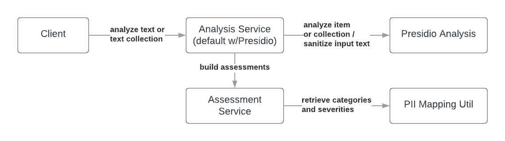

# Summary

PII-Codex is a collection of extended theoretical, conceptual, and policy works in personal identifiable information (PII) categorization and severity assessment [@schwartz_solove_2011; @milne_pettinico_hajjat_markos_2016], and the integration thereof with PII detection software and API client adapters. It allows researchers to analyze a body of text or a collection thereof and determine whether the PII detected within these texts, if any, are considered identifiable. Furthermore, it allows end-users to determine the severity and associated categorizations of detected PII tokens.

# Challenges

While several open-source PII detection libraries and even more PII detection clients are provided by cloud service providers [@azure_detection_cognitive_skill; @aws_comprehend], the detections often come with an index reference of where the detection is within the text and a confidence score associated with the detection. For those receiving these results, they aren’t provided with a means of understanding how the text is classified as PII, what framework, policy, or convention labels it as such, and just how severe.

# Statement of Need

The knowledge base of identifiable data, its use, and associated policies have shifted drastically over the years. The tech industry has seen many policy changes regarding the tracking of individuals, the usage of data from online profiles, and the right to be forgotten entirely from a service or platform [@gdpr]. Understanding if identifiable data types exist in a dataset can prevent accidental sharing of such data by allowing its detection in the first place and, in the case of this software, present sanitized and publishable results.

# The PII-Codex Package

PII-Codex is a Python package with an intended scope to combine the Information Sensitivity Typology works of Milne et al. [@milne_pettinico_hajjat_markos_2016], categorizations and guidelines from the National Institute of Standards and Technology (NIST) [@mccallister_grance_scarfone_2010], Department of Homeland Security (DHS) [@dhs_2012], and the Health Insurance Portability and Accountability Act (HIPAA) [@hipaa]. It combines these categories to rate the detection on a scale of 1 to 3, labeling it as Non-Identifiable, Semi-Identifiable, or Identifiable as presented by the risk continuum by Schwartz and Solove [@schwartz_solove_2011]. 

Built into the package is an analyzer service that leverages Microsoft’s Presidio library for PII detection and anonymization [@microsoft_presidio] as well as the option to use the built-in detection adapters for Microsoft Presidio, Azure Detection Cognitive Skill [@azure_detection_cognitive_skill], and AWS Comprehend [@aws_comprehend] for pre-existing detections. The output of the adapters are analysis objects with a listing of detections, severities, mean risk scores for each string processed, and summary statistics on the analysis made. The final outputs do not contain the original texts but provide the sanitized or anonymized texts and where to find the detections, should the end-user require this information. In providing this capability, one can prevent the accidental dissemination of private information in downstream research efforts, an issue commonly discussed in cybersecurity research [@moura_serrão_2019; @beigi_liu_2020].

## Design

PII-Codex is broken down into a series of services, utils, and adapters. For a majority of cases, end-users may already have used Microsoft Presidio, Azure, or AWS Comprehend to detect PII in text. To account for these cases, adapters were provided to convert the varying detection results into a common form, later used by the Analysis Service and Assessment Service.


For end-users that still require detections to be carried out, Microsoft Presidio was integrated as the primary analysis provider within the Analysis Service.



The Analysis and Assessment services expose functions for those defining their own detectors and enables the conversion to a common detection type so that the full Analysis Result set can be built.

## Example Usage

The collection analysis permits a list of strings under `texts` parameter or a dataframe with a text column under the `data` parameter.

Using the `texts` parameter:

```python
from pii_codex.services.analysis_service import PIIAnalysisService

pii_analysis_service = PIIAnalysisService()

strings_to_analyze = [
    "email@example.com is the email I can be reached at.", 
    "Their number is 555-555-5555"
]

results = pii_analysis_service.analyze_collection(
    texts=strings_to_analyze
)
```

Using the `data` parameter with metadata support for social media analysis:

```python
import pandas as pd
from pii_codex.services.analysis_service import PIIAnalysisService

pii_analysis_service = PIIAnalysisService()

results = pii_analysis_service.analyze_collection(
    data=pd.DataFrame.from_dict({
        "text": [
            "email@example.com is the email I can be reached at.", 
            "Their number is 555-555-5555"
        ],
        "metadata": [
            {"location": True, "url": False, "screen_name": True},
            {"location": False, "url": False, "screen_name": True}
        ]
    }),
    collection_name="Social Media Example",
    collection_type="SAMPLE"
)
```

The AnalysisResultSet object will show individual detections and their risk assessments. Email detections, for example, are presented as identifiable and direct PII which automatically place it at a risk level of 3, the highest a token is assigned.


```json
{
    "pii_type_detected": "EMAIL_ADDRESS",
    "risk_level": 3,
    "risk_level_definition": "Identifiable",
    "cluster_membership_type": "Personal Preferences",
    "hipaa_category": "Protected Health Information",
    "dhs_category": "Stand Alone PII",
    "nist_category": "Directly PII",
    "entity_type": "EMAIL_ADDRESS",
    "score": 1.0,
    "start": 74,
    "end": 94
}
```

Each analysis is provided with the sanitized input text when using the default analysis service. Unless provided with another replacement token, sanitized input text will contain `<REDACTED>` in place of detected PII tokens:

```
"sanitized_text": "Hi! My phone number is <REDACTED>."
```

## Availability
PII-Codex can be installed via pip or poetry. The source code of PII-Codex is available at the GitHub repository (https://github.com/EdyVision/pii-codex). The builds can be obtained from https://github.com/EdyVision/pii-codex/releases.

# References